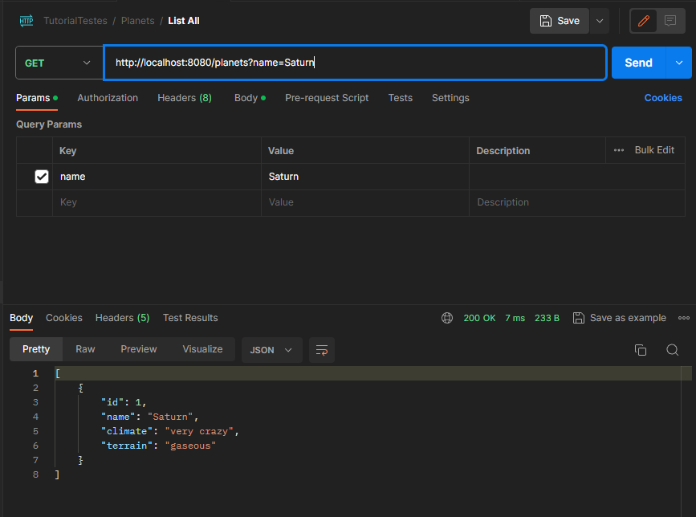
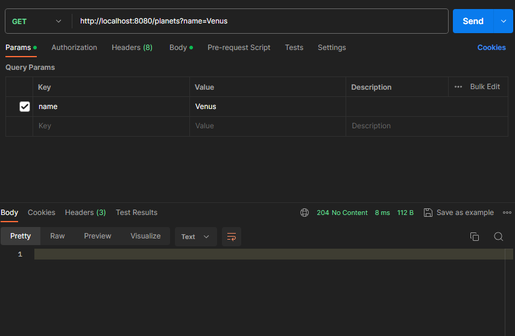

# Repositório de código do laboratório de testes na prática utilizando junit e spring boot.
### Aluno: Francisco Iratuã Nobre Júnior

* url do curso: (https://www.udemy.com/course/testes-automatizados-na-pratica-com-spring-boot)
* data de início: 19/12/2023

### Criação do projeto

Crie um projeto utilizando o spring initializer (https://start.spring.io)
Dependências:
* spring-boot-starter-web
* spring-boot-starter-data-jpa
* postgresql
* spring-boot-starter-test

Faça o download do SGDB Postgres e instale em sua máquina. Você pode utilizar um container docker como opção.
Crie uma base de dados e configure o arquivo resources/applicattion.properties da seguinte forma
```
# Informações da conexão com a base de dados
spring.datasource.url=jdbc:postgresql://localhost:5432/udemy_lab_testes
spring.datasource.username=postgres
spring.datasource.password=postgres
spring.datasource.driver-class-name=org.postgresql.Driver

spring.jpa.hibernate.ddl-auto=update
spring.jpa.show-sql=true
spring.jpa.properties.hibernate.format_sql=true
```
 *não esqueça de configurar corretamente o nome da base, usuário e senha de acesso ao banco de dados*
 
__________
## Criando as classes iniciais
Os pacotes são indicados na primeira linha de código de cada classe.
Atente que, criamos uma classe auxiliar para efetuar os testes, chamada 'PlanetConstants';
A razão da sua existência é unicamente auxiliar os testes, instanciando um objeto com os dados controlados.

*Planet.java*

```java
package br.com.udemy.domain;

import jakarta.persistence.*;
import org.apache.commons.lang3.builder.EqualsBuilder;

@Entity
@Table(name = "planets")
public class Planet {
    @Id
    @GeneratedValue(strategy = GenerationType.IDENTITY)
    private Long id;
    private String name;
    private String climate;
    private String terrain;

    public Planet() {

    }

    public Planet(String name, String climate, String terrain) {
        this.name = name;
        this.climate = climate;
        this.terrain = terrain;
    }

    public Long getId() {
        return id;
    }

    public void setId(Long id) {
        this.id = id;
    }

    public String getName() {
        return name;
    }

    public void setName(String name) {
        this.name = name;
    }

    public String getClimate() {
        return climate;
    }

    public void setClimate(String climate) {
        this.climate = climate;
    }

    public String getTerrain() {
        return terrain;
    }

    public void setTerrain(String terrain) {
        this.terrain = terrain;
    }

    @Override
    public boolean equals(Object obj){
        return EqualsBuilder.reflectionEquals(obj, this);
    }
}
```
*PlanetRepository.java*
````
package br.com.udemy.domain;

import org.springframework.data.jpa.repository.JpaRepository;
import org.springframework.stereotype.Repository;

@Repository
public interface PlanetRepository extends JpaRepository<Planet, Long> {
}

````

*PlanetService.java*
````java
package br.com.udemy.domain;

import org.springframework.beans.factory.annotation.Autowired;
import org.springframework.stereotype.Service;

@Service
public class PlanetService {

    @Autowired
    private PlanetRepository repository;
    public Planet create(Planet planet) {
        return  repository.save(planet);
    }
}

````

Contexto de testes.

*PlanetServiceTest.java*
````java
package br.com.udemy.domain;

import br.com.udemy.common.PlanetSingleton;
import org.junit.jupiter.api.Test;
import org.junit.jupiter.api.extension.ExtendWith;
import org.mockito.InjectMocks;
import org.mockito.Mock;
import org.mockito.junit.jupiter.MockitoExtension;

import static org.assertj.core.api.Assertions.assertThat;

import static org.mockito.Mockito.when;

/*
 * Regra para nomeação dos métodos
 * operacao_estado_retorno
 */
@ExtendWith(MockitoExtension.class)
class PlanetServiceTest {

    @InjectMocks
    private PlanetService planetService;

    @Mock
    private PlanetRepository planetRepository;

    /*
    * Exemplo de teste do tipo AAA onde
    * */
    @Test
    public void createPlanet_WithValidData_ReturnsPlanet() {
        Planet planet = PlanetSingleton.getInstance();

        // Mockando o comportamento
        // Arrange -> Primeiro A de AAA
        when(planetRepository.save(planet)).thenReturn(planet);

        // Act -> Segundo A de AAA
        // system under test (geralmente, o retorno esperado)
        Planet sut = planetService.create(planet);

        // Assert -> Terceiro A de AAA
        assertThat(sut).isEqualTo(planet);
    }

}
````

*PlanetConstants.java *
````java
package br.com.udemy.common;

import br.com.udemy.domain.Planet;

public class PlanetConstants {
    public static  final Planet PLANET = new Planet("name","climate","terrain");
}

````

*Refactory para PlanetSingleton.java*
Fizemos essa alteração para introduzir boas práticas e padrões de projetos. Sinta-se livre para escolher a melhor abordagem.
_O Singleton é um padrão de projeto criacional, que garante que apenas um objeto desse tipo exista e forneça um único ponto de acesso a ele para qualquer outro código._
````java
package br.com.udemy.common;

import br.com.udemy.domain.Planet;

public class PlanetSingleton {
    private static Planet instance;
    public static Planet getInstance(){
        if (instance == null){
            instance =  new Planet("name","climate","terrain");
        }
        return instance;
    }
}

````


### Implementando o cenário de erro
Adicione na classe PlanetSingleton.java o seguinte método, que retornará uma instância inválida de planeta.
````java
  public static Planet getInvalidInstance(){
        if (instance == null){
            instance =  new Planet("","","");
        }
        return instance;
    }
````

Na classe PlanetServiceTest.java, acrescente  o método responsável por testar o comportamento de exception.
````java
  @Test
    public void createPlanet_WithInvalideData_ThrowsException(){
        Planet invalidPlanet = PlanetSingleton.getInvalidInstance();
        when(planetRepository.save(invalidPlanet)).thenThrow(RuntimeException.class);
        assertThatThrownBy(() -> planetService.create(invalidPlanet)).isInstanceOf(RuntimeException.class);
    }
   
````

Note que instanciamos um planeta que seria inválido para persistência e simulamos o comportamento no caso da tentativa de persistência do objeto.
Em seguinda, averiguamos se, de fato, uma exception do tipo DataValidationException, ja que o tipo de dado informado não é válido, é lançada.

_______

## Desenhando a API 
Nesse ponto, iremos desenvolver uma API do tipo REST que nos sirva o recurso PLANET.

Iremos utilizar o [Postman](https://www.postman.com/downloads/) para fazer as requisições, mas você pode utilizar o [Isomnia](https://insomnia.rest/download) caso queira.
Iremos utilizar algumas boas práticas


#### Atualizando a classe PlanetService.java
Iremos adicionar funcionalidades à nossa camada de serviço, portanto, atualize o código da classe conforme o exemplo abaixo.

````java
package br.com.udemy.domain;

import org.springframework.beans.factory.annotation.Autowired;
import org.springframework.stereotype.Service;

import java.util.List;
import java.util.Optional;

@Service
public class PlanetService {

    @Autowired
    private PlanetRepository repository;

    public List<Planet> listAll(){
        return repository.findAll();
    }
    public Planet create(Planet planet) {
        return  repository.save(planet);
    }

    public Optional<Planet> get(Long id) {
        return repository.findById(id);
    }
}

````
Essa atualização vai prover novos comportamentos para nossa camada de serviço.

#### Implementando métodos na camada de controle.

Esse código faz com que a classe PlanetController.java possua um comportamento específico, um estereótipo, do tipo RESTCONTROLLER, que o spring já entrega para você.

````java
package br.com.udemy.web;

import br.com.udemy.domain.Planet;
import br.com.udemy.domain.PlanetService;
import org.springframework.beans.factory.annotation.Autowired;
import org.springframework.http.HttpStatus;
import org.springframework.http.HttpStatusCode;
import org.springframework.http.ResponseEntity;
import org.springframework.web.bind.annotation.*;

import java.util.List;

@RestController
@RequestMapping("/planets")
public class PlanetController {

    @Autowired
    private PlanetService service;

    @GetMapping
    public ResponseEntity<List<Planet>> listAllPlanets() {
        var planets = service.listAll();
        if (planets.isEmpty()) {
            return ResponseEntity.noContent().build();
        }
        return ResponseEntity.ok(planets);
    }

    @PostMapping
    public ResponseEntity<Planet> createPlannet(@RequestBody Planet planet) {
        var planetCreated = service.create(planet);
        return ResponseEntity.status(HttpStatus.CREATED).body(planetCreated);
    }

    @GetMapping("/{id}")
    public ResponseEntity<Planet> getPlanetById(@PathVariable("id") Long id) {
        return service.get(id).map(planet -> ResponseEntity.ok(planet))
                .orElseGet(() -> ResponseEntity.notFound().build());
    }
}

````
Note a forma como os métodos foram escritos, bem como suas anotações que define a forma como os dados irão trafegar através da api.

````java
 @GetMapping
 public ResponseEntity<List<Planet>> listAllPlanets() {
        var planets = service.listAll();
        if (planets.isEmpty()) {
            return ResponseEntity.noContent().build();
        }
        return ResponseEntity.ok(planets);
    }
````
Esse método é invocado através do método GET e retorna a lista de planetas cadastrados em nossa base de dados.
Caso não existam planetas cadastrados, a API vai retornar o status 204, que é o status code indicado para esse cenário.


```` java
   @PostMapping
    public ResponseEntity<Planet> createPlannet(@RequestBody Planet planet) {
        var planetCreated = service.create(planet);
        return ResponseEntity.status(HttpStatus.CREATED).body(planetCreated);
    }
````
Esse método cria um recurso. Note que um objeto é esperado quando você invoca o método, ou seja, você vai passar a configuração do planeta que será criado.
Ao fim do processo, o método retorna o status 201, informando que o recurso foi criado com sucesso.


```java
@GetMapping("/{id}")
    public ResponseEntity<Planet> getPlanetById(@PathVariable("id") Long id) {
        return service.get(id).map(planet -> ResponseEntity.ok(planet))
                .orElseGet(() -> ResponseEntity.notFound().build());
    }
```

Esse método é o responsável por buscar um registro específico na base de dados.
Note que ele é invocado através do método GET, porém, passamos um ID, que é a chave de identificação do registro na base de dados.
Esse método tem um comportamento particularmente interessante, que é o cenário em que o ID informado não retorne um registro na base de dados.
Nesse caso, enviamos um status 404, informando que aquele registro não foi encontrado, mantendo assim a fluência e clareza da api.

#### Persistindo um planet via API
Para persistir uma entidade através da api, devemos invocar o método POST da nossa api, enviando a configuração do recurso que será criado.


Agora, podemos chamar também o método listar todos, que é uma chamada através do método GET da nossa api.


Note que, não precisamos criar uma tabela. O hibernate se encarregou disso pra gente.

Através dessa configuração aqui, no arquivo application.properties
````
spring.jpa.hibernate.ddl-auto=update
````
Legal, não é?!

### Adicionando os testes para busca de determinado planet por ID
Já implementamos na camada de serviço e controller nossa detalhamento do planeta, passando como parâmetro o ID do mesmo, que pode ser recuperado na listagem de planetas.
Agora, iremos implementar os testes de unidade para os cenários 
*Planeta corresponde ao ID informado
*planeta não corresponde ao ID informado

Adicione os dois métodos abaixo à classe PlanetServiceTest.java

````java
    @Test
    public void getPlanet_ByExistingId_ReturnsPlanet(){
        // Recupera uma instância válida de planet
        Planet planet = PlanetSingleton.getInstance();
        // Cenário que mocka o comportamento
        when(planetRepository.findById(any())).thenReturn(Optional.ofNullable(planet));
        // SUT
        Optional<Planet> sut = planetService.get(1L);
        // Verificações
        // Note que verificamos se o optional retorna uma instância
        assertThat(sut).isNotEmpty();
        // Verificamos se a instância retornada, de fato, coincide com o esperado.
        assertThat(sut.get()).isEqualTo(planet);
    }
````

````java
    @Test
    public void getPlanet_ByUnexistingId_ReturnsEmpty(){
        // Cenário que mocka o comportamento
        when(planetRepository.findById(any())).thenReturn(Optional.empty());
        // SUT
        Optional<Planet> sut = planetService.get(1L);
        // Verificações
        assertThat(sut).isEmpty();
    }
````

Deixei uns comentário para ajudar no entendimento do código, mas em resumo, ele faz exatamente o que os comentários indicam.
Ele testa os dois cenários que precisamos testar, mantendo os testes fieis aos cenários em que serão utilizados.
_____
#### Filtrando os dados por atributos dos planetas
Precisamos agora, permitir que nossa API seja capaz de filtrar o resultado de acordo com as características dos planetas.
Para isso, precisamos alterar algumas coisas, como:

O método listarAllPlanets na classe PlanetController.java
````java
    @GetMapping
    public ResponseEntity<List<Planet>> listAllPlanets(Planet planet) {
        var matcher = ExampleMatcher
                .matching()
                .withIgnoreCase()
                .withStringMatcher(ExampleMatcher.StringMatcher.CONTAINING);
        var example = Example.of(planet, matcher);
        var planets = service.listAll(example);
        if (planets.isEmpty()) {
            return ResponseEntity.noContent().build();
        }
        return ResponseEntity.ok(planets);
    }
````

O método listAll na classe PlanetService.java
````java
    public List<Planet> listAll(Example<Planet> example){
        return repository.findAll(example);
    }
````

E em seguida, em seguida, testaremos via postman o retorno da API quando informarmos alguma característica do planeta.
Ao chamar a API enviando, por exemplo, o name=Saturn, obtemos um registro, como esperado.


Porém, ao informar um nome de um planeta que não esteja cadastrado, obtemos um status 204, no content, conforme o esperado.


Em seguida, iremos implementar os testes de unidade para esse cenário.
_______
#### Testando o cenário de filtro por nome do planeta
Para testar o cenário, iremos acrescentar mais dois testes à nossa classe PlanetServiceTest.java
que são:
Esse, que testa o cenário positivo
````java
    @Test
    public void getPlanets_ByExistingName_ReturnsListOfPlanets(){

        //Preparando o cenário
        var planet = PlanetSingleton.getInstance();
        planet.setName("Saturn");
        var matcher = ExampleMatcher
                .matching()
                .withIgnoreCase()
                .withStringMatcher(ExampleMatcher.StringMatcher.CONTAINING);
        var example = Example.of(planet, matcher);
        var listOfPlanets = List.of(planet);
        // Cenário que mocka o comportamento
        when(planetRepository.findAll(example)).thenReturn(listOfPlanets);

        //SUT
        var sut = planetService.listAll(example);
        // Verificações
        assertThat(sut).isEqualTo(listOfPlanets);
    }
````
E esse, para o cenário negativo.
````java

    @Test
    public void getPlanets_ByUnexistingName_ReturnsEmptyList(){

        //Preparando o cenário
        var planet = PlanetSingleton.getInstance();
        planet.setName("Unexisting Name");
        var matcher = ExampleMatcher
                .matching()
                .withIgnoreCase()
                .withStringMatcher(ExampleMatcher.StringMatcher.CONTAINING);
        var example = Example.of(planet, matcher);
        List<Planet> emptyList = Collections.emptyList();
        // Cenário que mocka o comportamento
        when(planetRepository.findAll(example)).thenReturn(emptyList);

        //SUT
        var sut = planetService.listAll(example);
        // Verificações
        assertThat(sut).isEmpty();
    }
````

Rode a suite de testes e verifique se todos os testes passaram com sucesso.


#### Modificando o controller PlanetController.java e a classe de testes para encapsular o construtor de consulta dinâmica.
Um ponto ainda não foi explicado sobre o funcionamento dos filtros. Para evitarmos de criar um método que se adeque a cada cenário,
iremos utilizar o ExampleMatcher. Ele é um construtor dinâmico de consultas que verifica em que você passa um objeto que será seu exemplo. 
Esse objeto terá as propriedades que deverão ser filtradas e será enviada para o repositório, e é aí que a mágia acontece: 
O spring se encarregará de fazer as buscas atendendo ao cenário.

Iremos construir um Builder que irá retornar esse construtor de consulta para nós.

Crie a classe QueryBuilderPlanet.java com o seguinte código:
````java
package br.com.udemy.domain;

import org.springframework.data.domain.Example;
import org.springframework.data.domain.ExampleMatcher;

public class QueryBuilderPlanet {
    public static Example build(Planet planet){
        var matcher = ExampleMatcher
                .matching()
                .withIgnoreCase()
                .withStringMatcher(ExampleMatcher.StringMatcher.CONTAINING);
        var example = Example.of(planet, matcher);

        return example;
    }
}
````

E altere as classes PlanetController.java no método listAllPlanets
````java
    @GetMapping
    public ResponseEntity<List<Planet>> listAllPlanets(Planet planet) {
        var example = QueryBuilderPlanet.build(planet);
        var planets = service.listAll(example);
        if (planets.isEmpty()) {
            return ResponseEntity.noContent().build();
        }
        return ResponseEntity.ok(planets);
    }

````
E a classe de testes nos métodos que testam a listagem
````java
    @Test
    public void getPlanets_ByExistingName_ReturnsListOfPlanets(){

        //Preparando o cenário
        var planet = PlanetSingleton.getInstance();
        planet.setName("Saturn");
        var example =  QueryBuilderPlanet.build(planet);
        var listOfPlanets = List.of(planet);
        // Cenário que mocka o comportamento
        when(planetRepository.findAll(example)).thenReturn(listOfPlanets);

        //SUT
        var sut = planetService.listAll(example);
        // Verificações
        assertThat(sut).isEqualTo(listOfPlanets);
    }

    @Test
    public void getPlanets_ByUnexistingName_ReturnsEmptyList(){

        //Preparando o cenário
        var planet = PlanetSingleton.getInstance();
        planet.setName("Unexisting Name");
        var example = QueryBuilderPlanet.build(planet);
        List<Planet> emptyList = Collections.emptyList();
        // Cenário que mocka o comportamento
        when(planetRepository.findAll(example)).thenReturn(emptyList);

        //SUT
        var sut = planetService.listAll(example);
        // Verificações
        assertThat(sut).isEmpty();
    }
````
Dessa forma, o projeto fica mais limpo, com menos repetição e mantem uma qualidade aceitável.

______
#### Criando a funcionalidade de excluir um planeta.
Iremos agora criar mais uma funcionalidade da nossa API: a de excluir um registro.
Para isso, iremos invocar o a api utilizando o método DELETE e passando o ID do registro que desejamos excluir.
Para isso, iremos iniciar criando a rota no controller.
A rota de remoção no controller é bem parecida com a rota de detalhamento.
```java
        @DeleteMapping("/{id}")
        public ResponseEntity deletePlanetById(@PathVariable("id") Long id) {
            try {
                service.delete(id);
                return ResponseEntity.noContent().build();
            }catch (EntityNotFoundException e){
                return  ResponseEntity.notFound().build();
            }
        }
```

Iremos adicionar também mais um método na classe PlanetService.java.
````java
     public void delete(Long id) {
        var optPlanet = repository.findById(id);
        if(optPlanet.isPresent()){
            repository.deleteById(id);
        }
            throw new EntityNotFoundException("Nenhum registro encontrado com o ID informado");
    }
````

E agora iremos implementar os testes dos dois cenários: 

**cenário onde queremos deletar um registro existente:**
Iremos adicionar o seguinte testes à nossa classe PlanetServiceTest.java.

Testando o cenário de sucesso
````java
    @Test
    public void removePlanet_WithExistingId_DoesNotThrowsException(){
        var planet = PlanetSingleton.getInstance();
        when(planetRepository.findById(1L)).thenReturn(Optional.ofNullable(planet));
       assertThatCode(()-> planetService.delete(1L)).doesNotThrowAnyException();
    }
````

Testando o cenário de falha
````java
    @Test
    public void removePlanet_WithUnexistingId_DoesThrowsException(){
        when(planetRepository.findById(99L)).thenReturn(Optional.empty());
        assertThatThrownBy(()-> planetService.delete(99L)).isInstanceOf(EntityNotFoundException.class);
    }
````